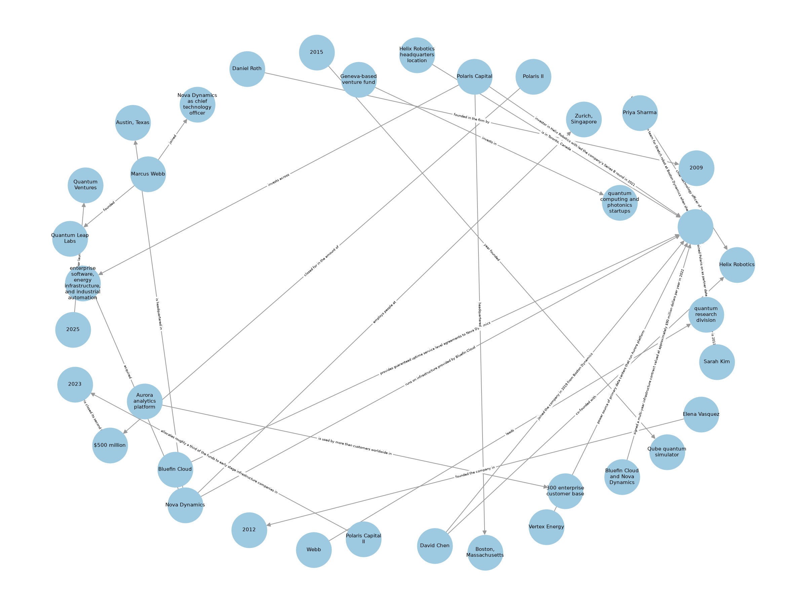

# Hybrid Graph-RAG Search & Extraction Pipeline


Enterprise-style RAG that combines **vector similarity (Qdrant)** with a
**knowledge graph (Neo4j)** in a single hybrid retrieval prompt. Built with
FastAPI + LlamaIndex; runs fully local (Ollama) or on OpenAI.

**Highlights:** hand-rolled hybrid merge (~40 lines, easy to walk through in
an interview) - idempotent re-ingests with content-hashed chunk IDs - measured
evaluation showing the graph compensates exactly where vector search weakens
(cross-doc questions: retrieval 80%, graph 80%, answer 80%).

## Architecture

```
                      ┌────────────► embed ──► Qdrant (vector search)
PDF ──► parse ──► chunk (shared chunk_id)
                      └────────────► LLM triple extraction ──► Neo4j (knowledge graph)

query ──► Qdrant top-k ──┐
                         ├─► merge into one prompt ──► LLM ──► answer
chunk_ids ──► Neo4j ─────┘   (triples + 1-hop expansion)
```

The same chunked text feeds both stores; every Neo4j relationship records the
`chunk_id` it came from. That ID is the join key for hybrid retrieval.

The knowledge graph extracted from the 4-document sample corpus:



## Setup

```bash
docker compose up -d
python -m venv .venv && .venv\Scripts\activate   # or: source .venv/bin/activate
pip install -r requirements.txt
cp .env.example .env   # set LLM_PROVIDER + OPENAI_API_KEY (or install Ollama)
uvicorn app.main:app --reload
curl localhost:8000/health   # -> {"qdrant": "ok", "neo4j": "ok"}
```

For `LLM_PROVIDER=ollama`, install Ollama on the host and pull a chat + embed
model (no API key needed):

```bash
ollama pull qwen3.5:2b && ollama pull nomic-embed-text   # tested default
ollama serve
```

For better answer quality, point `OLLAMA_LLM` at a larger model (e.g.
`llama3.1`) or set `LLM_PROVIDER=openai` with an `OPENAI_API_KEY`.

## Usage

Generate the sample corpus (4 fictional reports, or use any PDFs):

```bash
python make_sample_pdf.py
```

Ingest into both stores (CLI or API):

```bash
python -m app.ingest sample/*.pdf      # PowerShell: Get-ChildItem sample\*.pdf | % { python -m app.ingest $_.FullName }
curl.exe -F "file=@sample/industry_report.pdf" http://localhost:8000/ingest
```

Query with hybrid retrieval (vector hits + graph triples merged into the prompt):

```bash
python -m app.retrieve "Who founded Quantum Leap Labs?"
curl.exe -H "Content-Type: application/json" \
  -d '{"query": "Where is Nova Dynamics headquartered?"}' \
  http://localhost:8000/query
```

### API

| Endpoint | Method | Description |
|---|---|---|
| `/health` | GET | Connectivity check for Qdrant + Neo4j |
| `/ingest` | POST | Upload a PDF (multipart `file`) -> both stores |
| `/query` | POST | JSON `{"query": "..."}` -> `{answer, chunks, triples}` |

Inspect the graph at http://localhost:7474 (neo4j/password).

## Notes

- **Idempotent re-ingests**: chunk IDs are content hashes of the text, and
  splitting ignores file metadata (path/timestamps), so re-ingesting the same
  PDF upserts the same Qdrant points instead of duplicating them.
- Graph entities may grow slightly across re-ingests: triple extraction is
  LLM-driven, so re-runs can surface new phrasings as new facts.
- Small local models produce noisy extractions; the vector side is the stable
  idempotency contract.

## Evaluation

`python run_eval.py` scores the pipeline on a 15-question golden set
(`golden_qa.json`) derived from the sample corpus. Per question it checks
whether the expected fact appears in (1) the retrieved chunks, (2) the
surfaced graph triples, (3) the final answer. Questions are flagged
single-doc or cross-doc: cross-doc answers require joining facts that live in
different PDFs.

Measured with `qwen3.5:2b` (deterministic substring checks, n=15):

| Subset | Retrieval hit-rate | Graph coverage | Answer accuracy |
|---|---|---|---|
| Single-doc (n=10) | 100% | 70% | 70% |
| Cross-doc (n=5) | 80% | 80% | 80% |
| **Overall** | **93%** | **73%** | **73%** |

Reading: on cross-doc questions vector retrieval drops to 80% (the facts are
split across files and rank poorly), but graph coverage holds at 80% and
carries answer accuracy to parity with single-doc questions — the graph
compensates exactly where vector search weakens. The remaining gaps are LLM
quality: triple extraction misses some facts, and the small 2B model
occasionally fails to read the answer out of its own context. Both improve
with a larger model (`LLM_PROVIDER=openai` or a bigger Ollama model).
Extraction noise (e.g. `...` placeholders) is filtered at retrieval time.

## Key files

| File | What it does |
|---|---|
| `app/ingest.py` | PDF -> chunks -> Qdrant + LLM triple extraction -> Neo4j |
| `app/retrieve.py` | hybrid retrieval: vector hits + graph triples -> one prompt |
| `run_eval.py` | golden-set eval: retrieval hit-rate / graph coverage / answer accuracy |
| `app/main.py` | FastAPI: `/health`, `/ingest`, `/query` |

## Deliberately out of scope (next steps)

Auth, streaming responses, frontend, reranker, app
containerization, CI.
